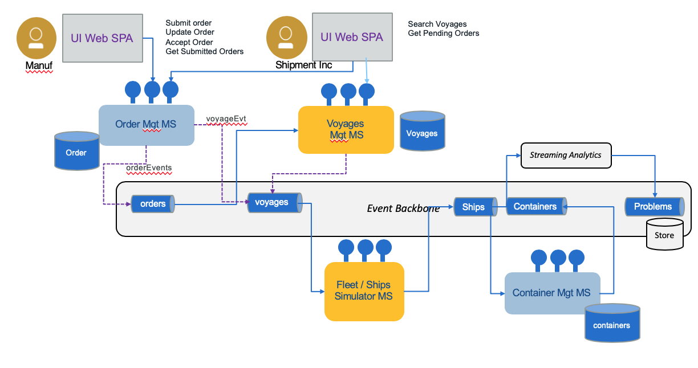

# Voyages and Fleet Simulation Solution Microservices

!!! abstract
        This repository includes a set of sub projects to implement the different microservices and functions to support the simulation of container shipment as introduced by [this main repository](https://ibm-cloud-architecture.github.io/refarch-kc).

This repository addresses the implementation of the orange boxes in the figure below:  



## Sub repositories

* The `fleet-ms` folder contains the Java App developed using microprofile and deployed on Open Liberty. It uses Kafka API to produce events. See [this chapter for details](fleetms.md) about deployment and code explanations.
* The `voyages-ms` folder contains the Node.js app for the voyages microservice also created with microprofile. It uses the Kafka API to produce events when an order has been assigned to a voyage. See [this chapter for details.](voyagems.md)

## Pre-requisites

You have two options to run the service using docker compose or Minikube. For Miniku we recommend following [those instructions](https://ibm-cloud-architecture.github.io/refarch-kc/deployments/minikube/#pre-requisites) in the root project to set up your environment. Anf for docker compose use [those instructions](https://ibm-cloud-architecture.github.io/refarch-kc/deployments/local/#pre-requisites).

!!! warning
        Be sure the back end service, kafka, zookeeper are running.

## Build


### Testing the fleet service

Read [those instructions >>]()

### Testing the voyage service

The script `.script/buildDocker.sh` build the docker image for this service.

## Run locally as Node.js application

This is more for development purpose in your sandbox.

```bash
npm install
npm test
npm start
```

## Deploy on IBM Kubernetes Service

```sh
# to install the helm release under browncompute namespace
$ helm install voyagesms/ --name kc-voyagesms --namespace browncompute 
# To see the pod deployment
$ kubectl describe pod voyagesms  --namespace browncompute
# To get the exposed port
$ kubectl get service kc-voyagesms
$ kubectl get service voyagesms-application-service -n browncompute
# Status and traced of the pods:
$ kubectl logs fleetms-deployment-58b7d58fb8-qcqz7  -n browncompute
# then point your URL to the ipaddress and port number:
http://
```

## NOT VERIFIED Build, run, and deploy using IDT

```bash
# Install needed dependencies:
npm run idt:install
# Build the docker image for your app:
npm run idt:build
# Run the app locally through docker:
npm run idt:run
# Deploy your app to IBM Cloud:
npm run idt:deploy
```

## Testing

### Testing the fleet service

### Testing the voyage service


## Further readings

* [Event driven architecture in IBM Garage method](https://www.ibm.com/cloud/garage/architectures/eventDrivenArchitecture)
* [Event driven compagnion github with other best practices](https://ibm-cloud-architecture.github.io/refarch-eda/)
* [Event-driven training journey](https://ibm-cloud-architecture.github.io/refarch-eda/eda-skill-journey/)
